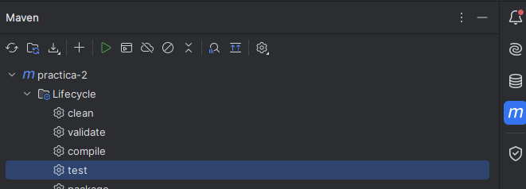

### Para ejecutar la aplicación debe ejecutar el pluguin "spring-boot:run" de Maven.

### Para ejecutar las pruebas con Playwright debe ejecutar la tarea "test" de lifecycle
### No es necesario ejecutar la aplicación previamente pues está se inicializa al momento de realizar las pruebas.
